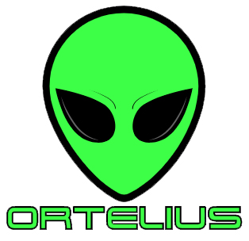
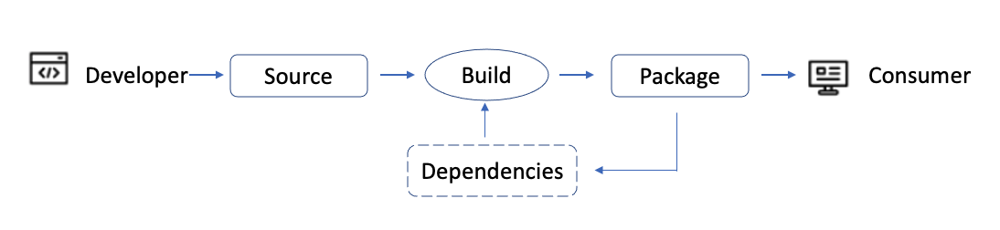
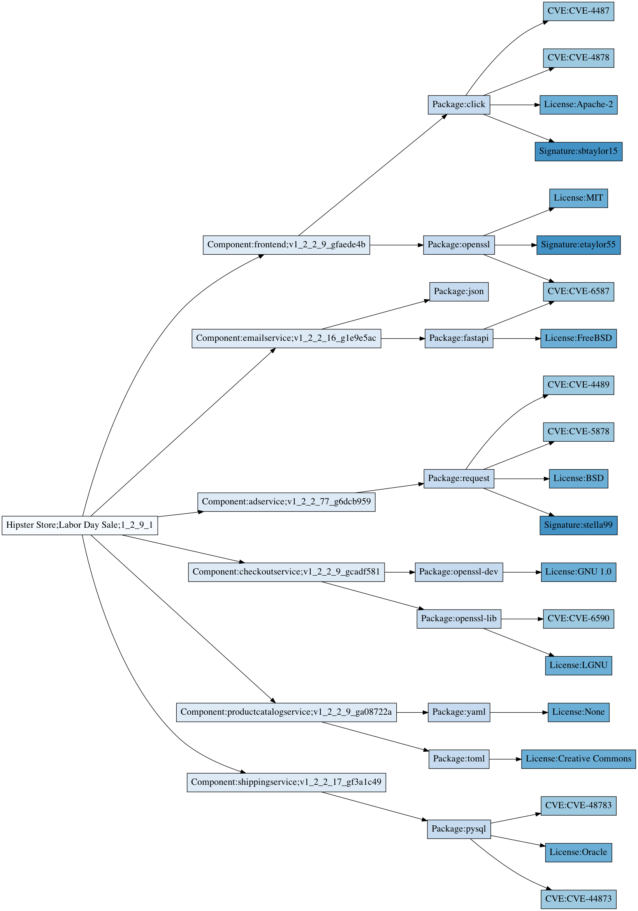

# Application SBOM Ledger

## Introduction
This document describes how the Ortelius Open Source community will build a blockchain that can create a continuous cloud-native software bill of material (SBOM) audit trail. It will show how the implementation of XRP ledger and non-fungible tokens can provide a global transaction log of low-level changes in the microservice software supply chain across open-source communities. It will also show how Federated Sidechains can offer the same benefits to private enterprises. The results of this implementation will lead to:
* Faster resolution of security issues
* Facilitate zero-trust policies,
* Provide quick notifications to consumers of shared services
* Clarify microservice usage and relationships
* Aggregate the 'logical' application SBOMs in a microservice implementation to meet federal requirements. 

### About Ortelius



[Ortelius](www.ortelius.io) is an open-source microservice unified catalog that simplifies the complexities of a cloud-native, microservice architecture. It centralizes critical information about microservice ownership, usage, relationships, tools, consumers and the people who support them. Ortelius is an incubating project at the [Linux Foundation's CDF](cd.foundation). All grant funding for this project will be managed by the Linux Foundation on behalf of the Ortelius open-source project.

The Ortelius GitHub project can be found at:[https://github.com/ortelius/ortelius](https://github.com/ortelius/ortelius)

### Traditional SBOMs

SBOMs are the answer to hardening cybersecurity. SBOM insights can potentially facilitate 'zero trust' policies and expose impact and vulnerabilities. SBOMs are critical in auditing software changes in traditional software development, including knowing who made the change and when they were made. In addition, SBOMs track the licensing and providence of the software raw materials (artifacts, source, libraries, etc.) related to a specific software solution version or application release.

"…with ripples felt by the global technology sector at large, was the Biden Administration's Executive Order on improving the Nation's Cybersecurity. This bellwether indicator put Software Bill of Material (SBOMs) at the forefront of software procurement practices.
 
 …SBOMs will play an essential role in building more trust and transparency in how all software is created, distributed and consumed throughout the supply chains."
  Jim Zemlin, Executive Director Linux Foundation, [Software Bill of Materials and Cybersecurity Readiness](https://www.linuxfoundation.org/tools/the-state-of-software-bill-of-materials-sbom-and-cybersecurity-readiness/)

### Cloud-Native SBOM Challenges

At present, several security challenges face both the open-source community and the enterprise that rely on open-source technology in a cloud-native, microservice architecture: 

* Traditional SBOMs are generated at 'build' time. In a cloud-native environment, SBOMs are created for a single microservice, but not at the application level. 
* Common shared objects can be quickly consumed across the ecosystem without visibility into their usage, providence, or ownership.
Application teams struggle to understand an application's software supply chain, including what versions of shared services they * consume. 
* IT engineering teams are tasked with providing application-level SBOMs without knowing their complete supply chain. 
* Transitive dependency scanning is done at the creation of the microservice image build, but there is no method of tracking what microservices a 'logical' application uses at runtime. 
* Cloud-native systems are so complex that humans can't track configurations and provide critical insights regarding the systems they design. 
* A microservice implementation disrupts the DevOps pipeline, leading to less, not more, automation and tracking. 

### Ortelius and SBOMs
A core feature of the Ortelius microservice catalog is to 'snapshot' all attributes of a microservice and expose changes to the services over time. In addition, Ortelius tracks collections of microservices to represent a 'logical' software solution (application) and aggregates microservice data up to the 'logical' applications that consume them. This relationship modeling allows Ortelius to create Application-level SBOMs in a microservice architecture based on an application version. 

As we move to improve the security around microservices, additional metadata is needed in the SBOM to audit all changes that can impact consuming 'logical' applications. For example, Ortelius records other attributes to the SBOM data to complete a broader picture of how the configuration changes over time. These additional attributes include, but are not limited to:
* key-value pairs
* inventory across clusters
* Swagger Input
* Container registry
* Git Commit
* Git SHA
* Git User
* Blast Radius (consuming applications)
* Number of lines changed
* CVEs
* Component package dependencies
* License consumption across all transitive dependencies 

This level of information is gathered at the microservice level and aggregated up to each consuming application version. In essence, Ortelius versions and snapshots every change that is made to a microservice and rolls up that snapshot to an Application Version. This snapshot versioning process can be enhanced using blockchain technology and will be the core of the Ortelius Application SBOM Ledger.

The Ortelius Application SBOM Ledger will track and audit changes to all 'logical' application versions based on updates made at the lower microservice level. 

### Additional Use Cases for the Ortelius Application SBOM Ledger
There are four main uses cases for this Blockchain Application SBOM Ledger:

1. Enforce 'zero-trust' by interrogating the signed providence of microservices. 
2. Auditing of microservice' drift' between clusters can be reported and automatically used to correct the drift. The desired state exists in the blockchain and can be used to correct a 'threat' when an incorrect 'version' is detected across clusters.
Provide a notification model with immediate feedback to all consumers impacted by a threat. For example, a single location to track all users of Log4J, and notify them immediately of the required actions. 
3. Use events to build around particular required changes. For example, a fix to a CVE can trigger events across the DevOps pipeline to automatically address the vulnerability. 
4. The blockchain data can be used with OPA to determine the DevOps pipeline path of a microservice-based on a 'risk factor' defined by OPA.

As we move into more complex cloud-native systems, a level of microservice governance is required. The Ortelius Application SBOM Ledger approach is the beginning of a new disruptive approach to tracking all changes for SBOM reporting, with the ability to act on threats immediately. 


## Proposal Overview

The Application SBOM Ledger will extend SBOMs created at the low-level packaging stage of the microservice build step. It consumes outputs from many different build lifecycles, making an application's logical view.  


*Component Software Build Lifecycle*


In complex cloud-native systems, a new microservice build impacts multiple consuming applications. A new version of a microservice creates a new version of every 'logical' application that consumes that service. A 'logical' application is an immutable representation of the digital service delivered to the end-user. Each time a microservice is updated, the end-user is executing a new version of that 'logical' application. Additionally, any configuration change, such as key-value updates, creates a new logical application version.  

Logical Applications are comprised of the following relationships:
Logical application depends upon 1 -> N Component Versions
Component Version depends upon 0 -> N Component Versions
Component Version depends upon 1 -> N Component Packages
Component Package depends upon 0 -> N Component Packages
Component Package depends upon 0 -> N Software Licenses
Component Package depends upon 0 -> N CVEs (Common Vulnerabilities and Exposures)
Component Package depends upon a Creator Signatures

Software Bill of Material (SBOM) consists of data from D, E, F, and G.  These SBOMs are generated from the Component Software Build Lifecycle. 

Items A, B, C are generated using the Ortelius Open Source project. The generation step is triggered upon completion of the Component Software Build Lifecycle.


*Single Logical Application SBOM*

A single version of a Logical Application SBOM (LA SBOM) is an immutable snapshot of the dependencies and metadata. This LA SBOM version is represented as a non-fungible token (NTF).

```
Example NFToken JSON

{
    "TokenID": "000B013A95F14B0044F78A264E41713C64B5F89242540EE208C3098E00000D65",
    "URI": "ipfs://bafybeigdyrzt5sfp7udm7hu76uh7y26nf4dfuylqabf3oclgtqy55fbzdi"
}
```

The [XRPL implementation of the NTFS](https://xrpl.org/nftoken.html#retrieving-nftoken-data-and-metadata) does not include the metadata on the token; instead, it uses a pointer via the URI to an immutable object that is stored external to the blockchain. The recommended NTF metadata storage is on IPFS such as Protocol Labs called nft.storage. An LA-SBOM version would be represented initially in IPFS as JSON. The next iteration of storage would be a GraphDB such as [ArangoDB](https://www.arangodb.com/). The GraphDB would enable querying of the NFT metadata while ensuring immutability is maintained.

To prevent redundancy in the blockchain and NTF metadata, the microservice version would be split into its own NFT and shared by multiple LA SBOM versions. So the LA SBOM would reference the microservice version NFT blockchain.  

### Recorded Transactions

The transactions captured by the blockchain ledger include the creation of the microservice version NFT, the creation of the logical application (LA) SBOM version, and the consumption of a logical application SBOM version when it is deployed into a runtime environment, such as a Kubernetes cluster.    

[XRP Federated SideChains](https://xrpl.org/federated-sidechains.html#federated-sidechains) will be necessary to reference transactions that happen on blockchains that are maintained outside of the public XRP network. This scenario occurs when a company LA SBOM is comprised of both private microservice versions and public microservice versions, as well as private Package Signatures and public Package Signatures (see [Pyrsia](https://pyrisa.io/), [Sigstore](https://www.sigstore.dev/), [Notary v2](https://github.com/notaryproject/notaryproject)).

### Audit Results

The LA SBOM on XRPL provides quick answers to complex questions such as:
* What microservice, and what versions does my logical application use?
* What logical applications use a particular microservice version of a package? 

These types of questions can be answered quickly by interrogating the XRPL and associated NTFS for the LA SBOM. For example, as the developer of Log4J, the developer can see all of the consuming logical applications across the world. This information can be used to notify the consuming application developers that a fix is needed. On the flip side, an application developer can determine if they are using Log4J even if it is in a package they are not responsible for.

# Conclusion
As we shift from traditional development to complex cloud-native systems, the creation of application SBOMs becomes extremely difficult and progressively more important. The Application SBOM ledger is the next step in the supply chain process. SBOMs can not be limited to the 'build' level, which is a microservice in cloud-native architecture. SBOMs always have and will continue to be required at the application level. Methods to aggregate this data and track application versions will be critical for managing security across the software supply chain. 

Logical Application SBOMs on XRPL will reduce interrogation time, facilitate 'zero-trust,' reduce time to resolution, increase transparency, and provide an immutable ledger that can be used across organizational silos and open source projects. The Application SBOM ledger will be used by teams worldwide to consume and monitor shared objects and aggregate their application-level SBOMs. The result will be software transparency that supports quick vulnerability resolution creating a solid line of defense from security threats. 
