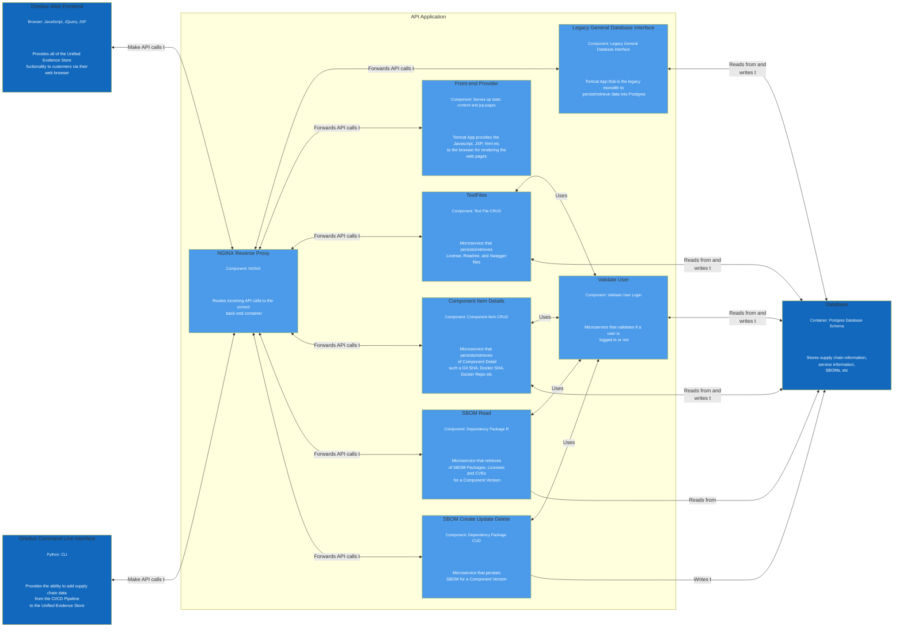

```mermaid
flowchart LR

subgraph orteliusUI[Ortelius Web Frontend]
    direction LR
    h3[Browser: JavaScript, JQuery, JSP]:::type
    d3[Provides all of the Unified Evidence Store\nfuctionality to customers via their\nweb browser]:::description
end
orteliusUI:::internalContainer

subgraph orteliusCLI[Ortelius Command Line Interface]
    direction LR
    h4[Python: CLI]:::type
    d4[Provides the ability to add supply chain data\nfrom the CI/CD Pipeline\nto the Unified Evidence Store]:::description
end
orteliusCLI:::internalContainer

subgraph database[Database]
    direction LR
    h6[Container: Postgres Database Schema]:::type
    d6[Stores supply chain information, \n service information, \n SBOMs, etc]:::description
end
database:::internalContainer

orteliusUI<--Make API calls to-->nginxReverseProxy
orteliusCLI<--Make API calls to-->nginxReverseProxy
nginxReverseProxy<--Forwards API calls to-->monolithGeneral
nginxReverseProxy<--Forwards API calls to-->monolithUI
nginxReverseProxy<--Forwards API calls to-->msTextFile
nginxReverseProxy<--Forwards API calls to-->msCompItem
nginxReverseProxy<--Forwards API calls to-->msDepPkgR
nginxReverseProxy<--Forwards API calls to-->msDepPkgCUD


subgraph apiApplication[API Application]
    subgraph nginxReverseProxy[NGINX Reverse Proxy]
        direction LR
        h10[Component: NGINX]:::type
        d10[Routes incoming API calls to the correct\n back-end container]:::description
    end
    nginxReverseProxy:::internalComponent

    subgraph monolithGeneral[Legacy General Database Interface]
        direction LR
        h20[Component: Legacy General Database Interface]:::type
        d20[Tomcat App that is the legacy monolith to\n persist/retrieve data into Postgres]:::description
    end
    monolithGeneral:::internalComponent

    subgraph monolithUI[Front-end Provider]
        direction LR
        h30[Component: Serves up static content and jsp pages]:::type
        d30[Tomcat App provides the Javascript, JSP, html etc\n to the browser for rendering the web pages]:::description
    end
    monolithUI:::internalComponent

    subgraph msValidateUser[Validate User]
        direction LR
        h40[Component: Validate User Login]:::type
        d40[Microservice that validates if a user is\n logged in or not]:::description
    end
    msValidateUser:::internalMS

    subgraph msTextFile[TextFiles]
        direction LR
        h50[Component: Text File CRUD]:::type
        d50[Microservice that persists/retrieves\n License, Readme, and Swagger files]:::description
    end
    msTextFile:::internalMS

    subgraph msCompItem[Component Item Details]
        direction LR
        h60[Component: Component Item CRUD]:::type
        d60[Microservice that persists/retrieves\n of Component Detail\n such a Git SHA, Docker SHA, Docker Repo etc]:::description
    end
    msCompItem:::internalMS

    subgraph msDepPkgCUD[SBOM Create Update Delete]
        direction LR
        h70[Component: Dependency Package CUD]:::type
        d70[Microservice that persists\n SBOM for a Component Version]:::description
    end
    msDepPkgCUD:::internalMS

    subgraph msDepPkgR[SBOM Read]
        direction LR
        h80[Component: Dependency Package R]:::type
        d80[Microservice that retrieves\n of SBOM Packages, Licenses and CVEs\n for a Component Version]:::description
    end
    msDepPkgR:::internalMS

    msTextFile<--Uses-->msValidateUser
    msCompItem<--Uses-->msValidateUser
    msDepPkgR<--Uses-->msValidateUser
    msDepPkgCUD<--Uses-->msValidateUser
end

monolithGeneral<--Reads from and \n writes to-->database
msValidateUser<--Reads from and \n writes to-->database
msTextFile<--Reads from and \n writes to-->database
msCompItem<--Reads from and \n writes to-->database
msDepPkgR<--Reads from---database
msDepPkgCUD--Writes to-->database

%% Element type definitions

classDef internalContainer fill:#1168bd
classDef internalComponent fill:#4b9bea
classDef internalMS fill:#4b9bea

classDef type stroke-width:0px, color:#fff, fill:transparent, font-size:12px
classDef description stroke-width:0px, color:#fff, fill:transparent, font-size:13px
```
