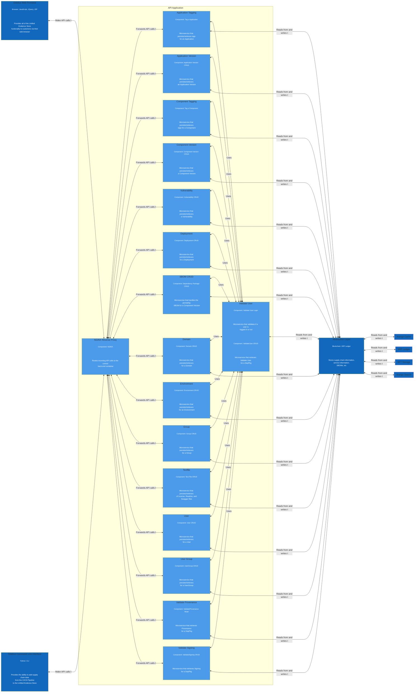

```mermaid
flowchart LR

subgraph orteliusUI[Ortelius Web Frontend]
    direction LR
    h10[Browser: JavaScript, JQuery, JSP]:::type
    d10[Provides all of the Unified Evidence Store\nfuctionality to customers via their\nweb browser]:::description
end
orteliusUI:::internalContainer

subgraph orteliusCLI[Ortelius Command Line Interface]
    direction LR
    h20[Python: CLI]:::type
    d20[Provides the ability to add supply chain data\nfrom the CI/CD Pipeline\nto the Unified Evidence Store]:::description
end
orteliusCLI:::internalContainer

orteliusUI<--Make API calls to-->nginxReverseProxy
orteliusCLI<--Make API calls to-->nginxReverseProxy
nginxReverseProxy<--Forwards API calls to-->msAppTag
nginxReverseProxy<--Forwards API calls to-->msAppVer
nginxReverseProxy<--Forwards API calls to-->msCompTag
nginxReverseProxy<--Forwards API calls to-->msCompVer
nginxReverseProxy<--Forwards API calls to-->msVulnerability
nginxReverseProxy<--Forwards API calls to-->msDeployment
nginxReverseProxy<--Forwards API calls to-->msDepPkg
nginxReverseProxy<--Forwards API calls to-->msDomain
nginxReverseProxy<--Forwards API calls to-->msEnvironment
nginxReverseProxy<--Forwards API calls to-->msGroup
nginxReverseProxy<--Forwards API calls to-->msTextfile
nginxReverseProxy<--Forwards API calls to-->msUser
nginxReverseProxy<--Forwards API calls to-->msUserGroup
nginxReverseProxy<--Forwards API calls to-->msValidateProvenance
nginxReverseProxy<--Forwards API calls to-->msValidateSigning


subgraph apiApplication[API Application]
    subgraph nginxReverseProxy[NGINX Reverse Proxy]
        direction LR
        h30[Component: NGINX]:::type
        d30[Routes incoming API calls to the correct\n back-end container]:::description
    end
    nginxReverseProxy:::internalComponent

    subgraph msAppTag[Application Tagging]
        direction LR
        h40[Component: Tag a Application]:::type
        d40[Microservice that persists/retrieves tags\n for an Application]:::description
    end
    msAppTag:::internalMS

    subgraph msAppVer[Application Version]
        direction LR
        h50[Component: Application Version CRUD]:::type
        d50[Microservice that persists/retrieves\n an Application Version]:::description
    end
    msAppVer:::internalMS

    subgraph msCompTag[Component Tagging]
        direction LR
        h60[Component: Tag a Component]:::type
        d60[Microservice that persists/retrieves\n tags for a Component]:::description
    end
    msCompTag:::internalMS

    subgraph msCompVer[Component Version]
        direction LR
        h70[Component: Component Version CRUD]:::type
        d70[Microservice that persists/retrieves\n a Component Version]:::description
    end
    msCompVer:::internalMS

    subgraph msVulnerability[Vulnerability]
        direction LR
        h80[Component: Vulnerability CRUD]:::type
        d80[Microservice that persists/retrieves\n a Vulnerability]:::description
    end
    msVulnerability:::internalMS

    subgraph msDeployment[Deployment]
        direction LR
        h90[Component: Deployment CRUD]:::type
        d90[Microservice that persists/retrieves\n for a Deployment]:::description
    end
    msDeployment:::internalMS

    subgraph msDepPkg[SBOM CRUD]
        direction LR
        h100[Component: Dependency Package CRUD]:::type
        d100[Microservice that handles the persisting\n SBOM for a Component Version]:::description
    end
    msDepPkg:::internalMS

    subgraph msDomain[Domain]
        direction LR
        h110[Component: Domain CRUD]:::type
        d110[Microservice that persists/retrieves\n for a Domain]:::description
    end
    msDomain:::internalMS

    subgraph msEnvironment[Environment]
        direction LR
        h120[Component: Environment CRUD]:::type
        d120[Microservice that persists/retrieves\n for an Environment]:::description
    end
    msEnvironment:::internalMS

    subgraph msGroup[Group]
        direction LR
        h130[Component: Group CRUD]:::type
        d130[Microservice that persists/retrieves\n for a Group]:::description
    end
    msGroup:::internalMS

    subgraph msTextfile[Textfile]
        direction LR
        h140[Component: Text File CRUD]:::type
        d140[Microservice that persists/retrieves\n of License, Readme, and Swagger files]:::description
    end
    msTextfile:::internalMS

    subgraph msValidateUser[Validate User]
        direction LR
        h150[Component: Validate User Login]:::type
        d150[Microservice that validates if a user is\n logged in or not]:::description
    end
    msValidateUser:::internalMS

    subgraph msUser[User]
        direction LR
        h160[Component: User CRUD]:::type
        d160[Microservice that persists/retrieves\n for a User]:::description
    end
    msUser:::internalMS

    subgraph msUserGroup[User Group]
        direction LR
        h170[Component: UserGroup CRUD]:::type
        d170[Microservice that persists/retrieves\n for a UserGroup]:::description
    end
    msUserGroup:::internalMS

    subgraph msValidateProvenance[Validate Provenance]
        direction LR
        h180[Component: ValidateProvenance Read]:::type
        d180[Microservice that retrieves Provenance\n for a DepPkg]:::description
    end
    msValidateProvenance:::internalMS

    subgraph msValidateSigning[Validate Signing]
        direction LR
        h190[Component: ValidateSigning CRUD]:::type
        d190[Microservice that retrieves Signing\n for a DepPkg]:::description
    end
    msValidateSigning:::internalMS

    subgraph msValidateUser[Validate User]
        direction LR
        h200[Component: ValidateUser CRUD]:::type
        d200[Microservice that retrieves Validate User\n for a DepPkg]:::description
    end
    msValidateUser:::internalMS

    msAppTag<--Uses-->msValidateUser
    msAppVer<--Uses-->msValidateUser
    msCompTag<--Uses-->msValidateUser
    msCompVer<--Uses-->msValidateUser
    msVulnerability<--Uses-->msValidateUser
    msDeployment<--Uses-->msValidateUser
    msDepPkg<--Uses-->msValidateUser
    msDomain<--Uses-->msValidateUser
    msEnvironment<--Uses-->msValidateUser
    msGroup<--Uses-->msValidateUser
    msTextfile<--Uses-->msValidateUser
    msUser<--Uses-->msValidateUser
    msUserGroup<--Uses-->msValidateUser
    msValidateProvenance<--Uses-->msValidateUser
    msValidateSigning<--Uses-->msValidateUser

end

msAppTag<--Reads from and \n writes to-->dbhandler
msAppVer<--Reads from and \n writes to-->dbhandler
msCompTag<--Reads from and \n writes to-->dbhandler
msCompVer<--Reads from and \n writes to-->dbhandler
msVulnerability<--Reads from and \n writes to-->dbhandler
msDeployment<--Reads from and \n writes to-->dbhandler
msDepPkg<--Reads from and \n writes to-->dbhandler
msDomain<--Reads from and \n writes to-->dbhandler
msEnvironment<--Reads from and \n writes to-->dbhandler
msGroup<--Reads from and \n writes to-->dbhandler
msTextfile<--Reads from and \n writes to-->dbhandler
msUser<--Reads from and \n writes to-->dbhandler
msUserGroup<--Reads from and \n writes to-->dbhandler
msValidateProvenance<--Reads from and \n writes to-->dbhandler
msValidateSigning<--Reads from and \n writes to-->dbhandler
msValidateUser<--Reads from and \n writes to-->dbhandler


 subgraph dbhandler[Abstraction Layer]
      direction LR
      h6[Python: Abstraction]:::type
      d6[Abstraction Layer]:::description
  end
 dbhandler:::internalContainer

  subgraph cache[Arango Cache]
      direction LR
      h6[Database: Arango Cache]:::type
      d6[Cache supply chain information, \n service information, \n SBOMs, etc]:::description
  end
  cache:::internalContainer

  subgraph search[Arango Search]
      direction LR
      h6[Database: Arango Cache]:::type
      d6[Cache supply chain information, \n service information, \n SBOMs, etc]:::description
  end
  search:::internalContainer

  subgraph nftstorage[NFT Storage]
      direction LR
      h6[IPFS: Nornmalized JSON Storage]:::type
      d6[Stores immutable supply chain information, \n service information, \n SBOMs, etc]:::description
  end
  nftstorage:::internalContainer

  subgraph xrpl[XRP Ledger]
      direction LR
      h6[Blockchain: XRP Ledger]:::type
      d6[Stores supply chain information, \n service information, \n SBOMs, etc]:::description
  end
  xrpl:::internalContainer


dbhandler<--Reads from and \n writes to-->cache
dbhandler<--Reads from and \n writes to-->xrpl
dbhandler<--Reads from and \n writes to-->nftstorage
dbhandler<--Reads from and \n writes to-->search

%% Element type definitions

classDef internalContainer fill:#1168bd
classDef internalComponent fill:#4b9bea
classDef internalMS fill:#4b9bea

classDef type stroke-width:0px, color:#fff, fill:transparent, font-size:12px
classDef description stroke-width:0px, color:#fff, fill:transparent, font-size:13px
```
