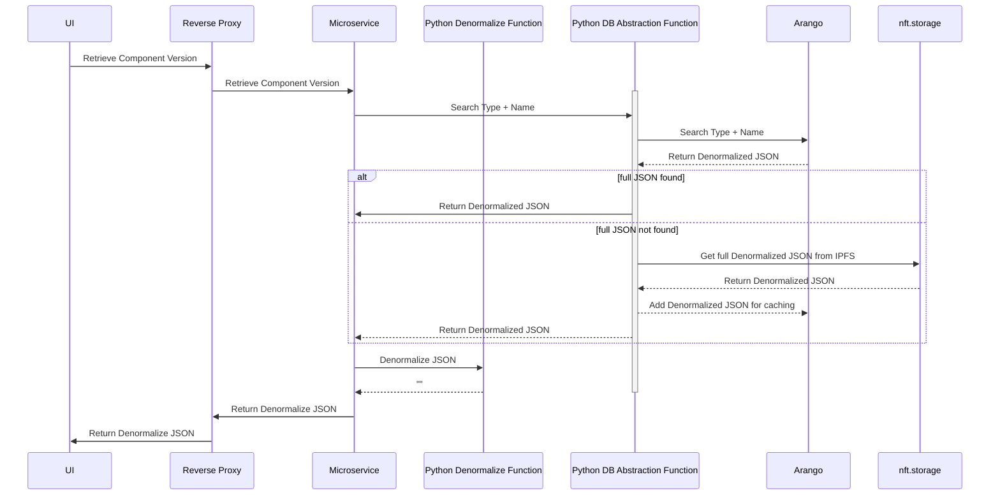

# Data retrieval using push though cache

```mermaid
sequenceDiagram
    participant UI
    participant proxy as Reverse Proxy
    participant ms as Microservice
    participant denormalize as Python Denormalize Function
    participant dbhandler as Python DB Abstraction Function
    participant arango as Arango
    participant nft as nft.storage
    UI->>proxy: Retrieve Component Version
    proxy->>ms: Retrieve Component Version

    activate dbhandler
    ms->>dbhandler: Search Type + Name
    dbhandler->>arango: Search Type + Name
    arango-->>dbhandler: Return Denormalized JSON
    alt full JSON found
        dbhandler->>ms: Return Denormalized JSON
    else full JSON not found
        dbhandler->>nft: Get full Denormalized JSON from IPFS
        nft-->>dbhandler: Return Denormalized JSON
        dbhandler-->>arango: Add Denormalized JSON for caching
        dbhandler-->>ms: Return Denormalized JSON
    end
    ms->>denormalize: Denormalize JSON
    denormalize-->>ms: ""
    deactivate dbhandler

    ms->>proxy: Return Denormalize JSON
    proxy->>UI: Return Denormalize JSON
```
