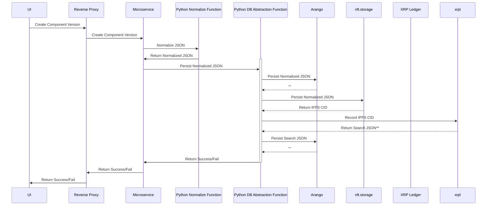

# Push through caching

```mermaid
sequenceDiagram
    participant UI
    participant proxy as Reverse Proxy
    participant ms as Microservice
    participant normalize as Python Normalize Function
    participant dbhandler as Python DB Abstraction Function
    participant arango as Arango
    participant nft as nft.storage
    participant bc as XRP Ledger
    UI->>proxy: Create Component Version
    proxy->>ms: Create Component Version
    ms->>normalize: Normalize JSON
    normalize->>ms: Return Normalized JSON

    activate dbhandler
    ms->>dbhandler: Persist Normalized JSON
    dbhandler->>arango: Persist Normalized JSON
    arango-->>dbhandler: ""
    dbhandler->>nft: Persist Normalized JSON
    nft-->>dbhandler: Return IFPS CID
    dbhandler->>xrpl: Record IPFS CID
    xrpl-->>dbhandler: Return Search JSON**
    dbhandler->>arango: Persist Search JSON
    arango-->>dbhandler: ""
    dbhandler->>ms: Return Success/Fail
    deactivate dbhandler

    ms->>proxy: Return Success/Fail
    proxy->>UI: Return Success/Fail
```

> ** Note: The Search JSON is the XRPL Block that contains the typical block data plus the metadata comprised of the: Object Type, Object Name, Object Domain Name
